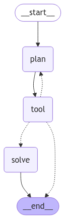
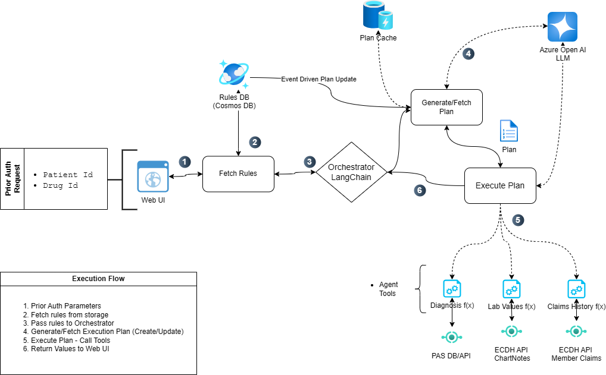

# Prior Authorization Copilot

## Overview

The process of approving prior authorization requests is often time consuming and error prone for Pharmacy Benefit Managers. This solution demonstrates the use of an LLM Copilot to assist a human reviewer in determining what patient data is required to approve a request and automatically fetching that data. The copilot will then reason over the fetched data to determine if individual conditions and requirements for approval can be met.

To create this Copilot, we will use the ReWOO pattern. [ReWOO](https://github.com/billxbf/ReWOO) (Reasoning WithOut Observation) is a variation of the ReACT pattern which detaches the reasoning process from external observations, thus significantly reducing token consumption. Since we anticipate a very high volume of requests for the system, it is desirable to minimize the token consumption where possible. We also want to reduce the variability introduced in subsequent calls to the LLM for planning once an acceptable plan has been established for a specific type of request (i.e. drug, device, procedure, etc).

### Process Flow



1. The first step in this process is to ask the LLM to create a plan for fetching and validating the required patient data. In this case, we will send a request to the LLM with a series of natural language questions, or "rules", that describe when a patient should be eligible to receive the Ozempic™ drug. Once the plan is created, and validated for accuracy by a human, it can be persisted for future requests for this drug.
2. The resulting plan is a series of steps, including tool calls, that the orchestrator should execute to augment the initial request with enough data to answer our questions which were used to generate the plan.
3. Once these steps are complete, the resulting data is sent to our "solver". The solver agent assembles the output and presents it to the human reviewer for a decision.

## Technical Architecture



## Components

Application folder structure

- src/api
  - agents
    - executor.py
    - planner.py
  - models
    - state.py
  - tools
    - drug_rules.py
    - patient_data.py
  - static
    - PriorAuth.html
  - main.py

| Component | Description |
|--|--|
| [planner.py](./src/api/agents/planner.py) | Contains the main prompt of the agent in charge of generating an execution plan. It takes a list of drug rules/questions as a parameter. <br>This prompt will have a plain English reference to each one of the tools that the plan will execute. These are data source specific tools (ChartNotes, ECDH, member claims, etc.) that will be used by the LLM depending on the question it is trying to answer. |
| [executor.py](./src/api/agents/executor.py) | Deals with processing an execution plan if it adheres to the ReWOO plan format. |
| [drug_rules.py](./src/api/tools/drug_rules.py) | Currently returns a hard coded list of rules/questions in plain English for Ozempic and Humira. This file should be replaced with a client that fetches data from a data repository. i.e. CosmosDB, SQL Server, etc. |
| [patient_data.py](./src/api/tools/patient_data.py) | An example of the definition of a tool that can be registered with the executor. A function needs to be decorated with the @tool decorator. In this case both functions return a JSON structure to the LLM. |


## API Endpoints

We have made available three endpoints that should cover the process of generating and executing an LLM execution plan:

The **/get_rules** endpoint retrieves the set of rules or questions related to the prior authorization approval process for a specific drug. The drug url query parameter is used to filter the specific set of rules needed. 

|  |  |
| -- | -- |
| Request Type | GET |
| Request URL | [BACKEND_APP_ENDPOINT]/get_rules?drug={drug_name} |

The **/generate_plan** endpoint accepts a POST request that includes a rules element. The rules element of the body is utilized by Langchain to generate a tool execution plan. Using Langchain as an orchestrator, the LLM leverages its tool execution skills to create the plan. The response from this endpoint will be a single JSON object containing the generative answer in a "text" value.

We included a separate plan generation endpoint for two main reasons:
•	The resulting plan can be stored and reused (cached) which will help control cost as it limits unnecessary calls to the LLM (a plan only needs to be generated once per drug or when the rules change). Also, it improves repeatability as the plan is not changing between executions as it is possible with a non-deterministic model (LLM).
•	We recommend including a human in the loop which will review the accuracy of a plan before it is executed. This only needs to happen when the plan is generated for a specific drug (or when the request approval rules change), not every time it is executed.

<table>
<tr><td>Request Type</td><td>POST</td></tr>
<tr><td>Request URL</td><td>[BACKEND_APP_ENDPOINT]/generate_plan</td></tr>
<tr><td>Headers</td><td>content-type: application/json</td></tr>
<tr><td valign="top">Body</td>
<td>

```json
{
    "drug": "Ozempic",
    "rules": "Patient must be 18 years or older AND Patient must have a confirmed diagnosis of Type 2 diabetes AND Patient must have an A1C level of 7.0% or higher AND Patient must have a fasting plasma glucose (FPG) greater than or equal to 126 mg/dL OR Patient must have a 2-hour plasma glucose (PG) greater than or equal to 200 mg/dL during OGTT (oral glucose tolerance test) OR Patient must have a random plasma glucose greater than or equal to 200 mg/dL in patient with classic symptoms of hyperglycemia or hyperglycemic crisis."
}
```

</td></tr>
</table>

The **/execute_plan** endpoint accepts a POST request that includes a task and a plan element. The task for this use case is the same every time:  "Is the patient with id {patient_id} eligible for the {drug_name} drug?". The task corresponds to the prompt used in the agents\executor.py file.
The tool execution plan that is stored in a permanent repository by drug name and generated by the generate_plan endpoint. Storing the execution plan has a few purposes:
•	Improves consistency and mitigates non-deterministic responses from the LLM and 
•	Cuts down on unnecessary use of LLM tokens for repeated plan generation per drug.
The response from this endpoint will be a single JSON object containing the generative answer in a "text" value.

<table>
<tr><td>Request Type</td><td>POST</td></tr>
<tr><td>Request URL</td><td>[BACKEND_APP_ENDPOINT]/execute_plan</td></tr>
<tr><td>Headers</td><td>content-type: application/json</td></tr>
<tr>
<td valign=top>Body</td>
<td>

```json
{
    "task": "Is the request for patient {patientId} eligible for {drug_name}?",
    "plan" : " DRUG_BASED_RULES"
}
```

</td>
</tr>
</table>


## Deployment

This repo is set up for deployment on Azure Container Apps using the configuration files in the `infra` folder.

Steps for deployment:

2. Install the [Azure Developer CLI](https://learn.microsoft.com/azure/developer/azure-developer-cli/install-azd). (If you open this repository in Codespaces or with the VS Code Dev Containers extension, that part will be done for you.)
3. Login to Azure:

    ```shell
    azd auth login
    ```

4. Provision and deploy all the resources:

    ```shell
    azd up
    ```

    It will prompt you to provide an `azd` environment name (like "fastapi-app"), select a subscription from your Azure account, and select a location (like "eastus"). Then it will provision the resources in your account and deploy the latest code. If you get an error with deployment, changing the location can help, as there may be availability constraints for some of the resources.

5. When `azd` has finished deploying, you'll see an endpoint URI in the command output. Visit that URI, and you should see the API output! 🎉
6. When you've made any changes to the app code, you can just run:

    ```shell
    azd deploy
    ```

## Costs

Pricing varies per region and usage, so it isn't possible to predict exact costs for your usage.
The majority of the Azure resources used in this infrastructure are on usage-based pricing tiers.
However, Azure Container Registry has a fixed cost per registry per day.

You can try the [Azure pricing calculator](https://azure.com/e/9f8185b239d240b398e201078d0c4e7a) for the resources:

- Azure Container App: Consumption tier with 0.5 CPU, 1GiB memory/storage. Pricing is based on resource allocation, and each month allows for a certain amount of free usage. [Pricing](https://azure.microsoft.com/pricing/details/container-apps/)
- Azure Container Registry: Basic tier. [Pricing](https://azure.microsoft.com/pricing/details/container-registry/)
- Log analytics: Pay-as-you-go tier. Costs based on data ingested. [Pricing](https://azure.microsoft.com/pricing/details/monitor/)

⚠️ To avoid unnecessary costs, remember to take down your app if it's no longer in use,
either by deleting the resource group in the Portal or running `azd down`.

